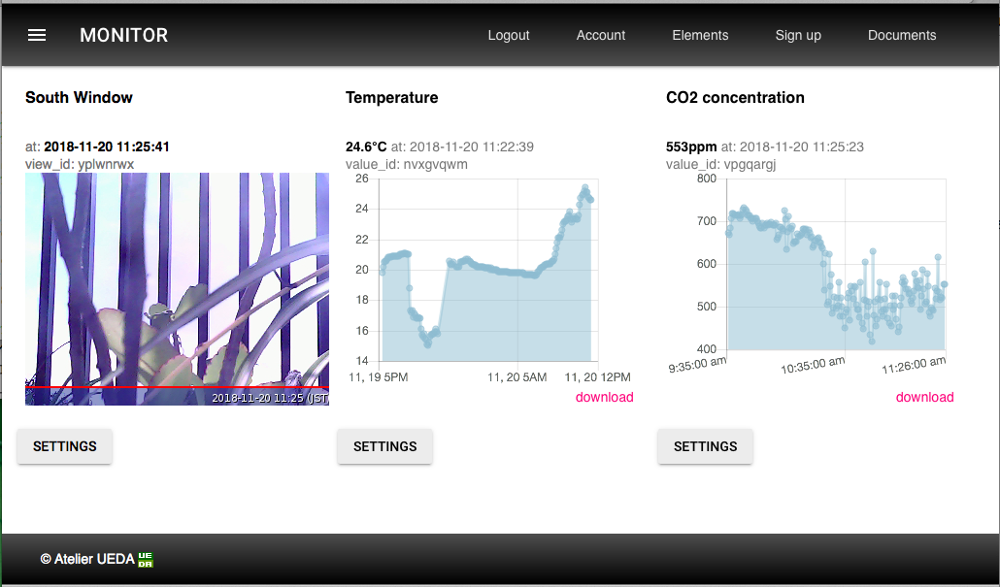

# mh-z19
Read CO<sub>2</sub> concentration from mh-z19 sensor and handle it.


## cabling
Connect RPi & mh-z19 as:

- 5V on RPi and Vin on mh-z19
- GND(0v) on RPi and GND on mh-z19
- TxD and RxD are connected to cross between RPi and mh-z18 

Followings are example of cabling, but you can free to use other 5v and 0v Pin on the RPi. 


```
pi@raspberrypi:~/mh-z19 $ gpio readall
 +-----+-----+---------+------+---+---Pi B+--+---+------+---------+-----+-----+
 | BCM | wPi |   Name  | Mode | V | Physical | V | Mode | Name    | wPi | BCM |
 +-----+-----+---------+------+---+----++----+---+------+---------+-----+-----+
 |     |     |    3.3v |      |   |  1 || 2  |   |      | 5v      |     |     |
 |   2 |   8 |   SDA.1 |   IN | 1 |  3 || 4  |   |      | 5v      |     |     |  <---- Vin
 |   3 |   9 |   SCL.1 |   IN | 1 |  5 || 6  |   |      | 0v      |     |     |  <---- Gnd
 |   4 |   7 | GPIO. 7 |   IN | 1 |  7 || 8  | 1 | ALT0 | TxD     | 15  | 14  |  <---- RxD
 |     |     |      0v |      |   |  9 || 10 | 1 | ALT0 | RxD     | 16  | 15  |  <---- TxD
 |  17 |   0 | GPIO. 0 |   IN | 0 | 11 || 12 | 0 | IN   | GPIO. 1 | 1   | 18  |
 |  27 |   2 | GPIO. 2 |   IN | 0 | 13 || 14 |   |      | 0v      |     |     |
 |  22 |   3 | GPIO. 3 |   IN | 0 | 15 || 16 | 0 | IN   | GPIO. 4 | 4   | 23  |
 |     |     |    3.3v |      |   | 17 || 18 | 0 | IN   | GPIO. 5 | 5   | 24  |
 |  10 |  12 |    MOSI |   IN | 0 | 19 || 20 |   |      | 0v      |     |     |
 |   9 |  13 |    MISO |   IN | 0 | 21 || 22 | 0 | IN   | GPIO. 6 | 6   | 25  |
 |  11 |  14 |    SCLK |   IN | 0 | 23 || 24 | 1 | IN   | CE0     | 10  | 8   |
 |     |     |      0v |      |   | 25 || 26 | 1 | IN   | CE1     | 11  | 7   |
 |   0 |  30 |   SDA.0 |   IN | 1 | 27 || 28 | 1 | IN   | SCL.0   | 31  | 1   |
 |   5 |  21 | GPIO.21 |   IN | 1 | 29 || 30 |   |      | 0v      |     |     |
 |   6 |  22 | GPIO.22 |   IN | 1 | 31 || 32 | 0 | IN   | GPIO.26 | 26  | 12  |
 |  13 |  23 | GPIO.23 |   IN | 0 | 33 || 34 |   |      | 0v      |     |     |
 |  19 |  24 | GPIO.24 |   IN | 0 | 35 || 36 | 0 | IN   | GPIO.27 | 27  | 16  |
 |  26 |  25 | GPIO.25 |   IN | 0 | 37 || 38 | 0 | IN   | GPIO.28 | 28  | 20  |
 |     |     |      0v |      |   | 39 || 40 | 0 | IN   | GPIO.29 | 29  | 21  |
 +-----+-----+---------+------+---+----++----+---+------+---------+-----+-----+
 | BCM | wPi |   Name  | Mode | V | Physical | V | Mode | Name    | wPi | BCM |
 +-----+-----+---------+------+---+---Pi B+--+---+------+---------+-----+-----+
```

## Install & Setup

### Full Set Install
Full Set include followings:

- Setup script: Install & Setup following useful stuffs as:
  - mh-z19:       A python module to read mh-z19 sensor.
  - PondSlider:   A multipurpose versatile sensor handler for python, which read mh-z19 value and handle it.
  - autostart.sh: Utility making mh-z19 as system service to act periodically.

Install Full Set, download from [release](https://github.com/UedaTakeyuki/mh-z19/releases)

```
git clone https://github.com/UedaTakeyuki/mh-z19.git
```

Then, got to the folder and issue ***setup.sh****

```
./setup.sh 
```
Necessary settings including serial port enabling are taken place in this script.

### Install only sensor module

For python 2.x
```bash:
sudo pip install mh_z19
```

For python 3.x
```bash:
sudo pip3 install mh_z19
```

In case you would use it [witout root permission](#how-to-use-without-root-permission), call pip without sudo as follows:

For python 2.x
```bash:
pip install mh_z19
```

For python 3.x
```bash:
pip3 install mh_z19
``` 

The differences of the interface between each Raspberry Pi model are resolved inside this module. For example, serial device name is difference between Raspberry Pi 3 and older model, but mh-z19 module automatically detect the model and read from appropriate serial device.

To use mh-z19, once you need to set up enabling serial port device on the Raspberry Pi.
Following [Wiki](https://github.com/UedaTakeyuki/mh-z19/wiki/How-to-Enable-Serial-Port-hardware-on-the-Raspberry-Pi) page might be informative.
Also, please refer [PyPi top page](https://pypi.org/project/mh-z19/) for detail.

## read CO2 Sensor value
```
pi@raspberrypi:~ $ sudo python -m mh_z19 
{'co2': 668}
```

As above, ***sudo*** might be necessary because mh-z19 sensor value is read through serial connection and it request root permission in general.

## Handle sensor value by [PondSlider](https://github.com/UedaTakeyuki/pondslider) multipurpose sensor handler.

The installed ***mh-z19*** module is correspond the [pondslider](https://github.com/UedaTakeyuki/pondslider) which is multiple & versatile sensor handler to save, send and to do other necessary ***something*** with the sensor value.

As an example, we introduce following use case:

- How to save sensor value to SD card as .CSV file.
- How to send sensor value to free Remote Monitoring Service.

### A brief explanation of pondslider
The pondslider read sensorvalue by ***sensor-handler*** specified, and pass the values to ***value-handlers**** which do something with it.


Both sensor and value handlers are python module. For more detail of handlers, please refer [this](https://github.com/UedaTakeyuki/pondslider).

### How to use sensor value to send to server, save to strage, and so on.
This module correspond the [pondslider](https://github.com/UedaTakeyuki/pondslider) which is multiple & versatile sensor handler to save, send and to do other necessary ***something*** with the sensor value.

In case you choiced ***Full Install*** mentioned above, in other words, you've done ***setup.sh***,
the pondslider and there example handler's are already installed & setup.


### How to save CO2 value on a SD card as a .CSV file.
You can do it with ***save2strage*** value handler which is in ***handlers/value/saver/save2strage***, and configuration file to read from mh-z19 sensor and save by save2strage is prepared as ***config.save.toml*** on the mh-z19 installed folder.

On the mh-z19 folder By calling pondslider as follows;

```
sudo python -m pondslider --config config.save.toml
```

Then, ***/home/pi/DATA/co2.csv*** should be created and new line will be added for each call.

### How to send CO2 Value to the MONITOR™ Service

The MONITOR™ is a free Remote Monitoring Service to show latest data on the web.

<p>


</p>

Please refer an [introduction](https://monitor.uedasoft.com/docs/UserGuide/) to grasp birds-eye understanding about MONIOR™.

A free account is available as [follow](https://monitor.uedasoft.com/docs/UserGuide/Signup.html).
Then, login and get a **view_id**, which is unique id to point a data area on the MONITOR™ to show latest value and chart, as [follow](https://monitor.uedasoft.com/docs/UserGuide/Value.html).

After get a value_id at your browser, return back to terminal of your Raspberry Pi, then you should set your this software to send measured value to the value_id. To do this, call **setid.sh** command in the mh_z19 installed directory. Let's say your value_id is ***vpgpargj***, issue ***setid.sh*** command as follows:

```
./setid.sh vpgpargj
```

Then, call "pondslider" python script as follows:

```
pi@raspberrypi:~/mh-z19 $ sudo python -m pondslider
{'co2': 742}
co2
{"ok":false,"reason":"ViewID not valid"}
```

Your time-series chart on the MONITOR™ display on the browser must be updated by the latest CO2 concentration value.

### How to set your Raspberry Pi to send CO2 data to MONITOR™ at 5 minute interval.
You can set it by autostart.sh command in the mh_z19 installed directory as follows:

```
./autostart.sh --on
```

You can turn off this as follows:

```
./autostart.sh --off
```

Also, You can check current status as follows:


```
./autostart.sh --status
```

For more detail, please refer this [blog](https://monitorserviceatelierueda.blogspot.com/2018/11/how-to-measure-room-co2-concentration.html). 

### How to send CO2 Value to the ATT M2X.

The Pondslider also support ATT M2X. For detail, please refer [this](https://github.com/UedaTakeyuki/handlers/blob/master/value/sender/send2m2x/README.md) document.

### Calibration, Detection range settings, and ABC(Automatic Baseline Correction) logic on/off.
Features about calibration (both MH-Z19 & MH-Z19B), detection range change (MH-Z19B) and ABC logic on/off(MH-Z19B) are implemented at version 0.2.1 or later.

I'm afraid I've just only implemented these without test due to lack necessary devices and apparatus for the test, fx: standard concentration CO2 GAS, also MH-Z19B module.
If you have these devices or apparatus and try to use these functions generously, I really appreciate your [issue report](https://github.com/UedaTakeyuki/mh-z19/issues) regardless result were positive or negative.

- positive report [with mh_z19b on a Raspberry Pi Zero W](https://github.com/UedaTakeyuki/mh-z19/issues/27), Thank you [richteas75](https://github.com/richteas75)!

For detail please refer this [wiki](https://github.com/UedaTakeyuki/mh-z19/wiki/CALIBRATION-&-detection-range).

## Undocumented response values of 0x86 command.
The [Revspace/MHZ19](https://revspace.nl/MHZ19#Command_0x86_.28read_concentration.29) shows values undocumented on the official datasheets ([MH-Z19](https://www.winsen-sensor.com/d/files/PDF/Infrared%20Gas%20Sensor/NDIR%20CO2%20SENSOR/MH-Z19%20CO2%20Ver1.0.pdf), [MH-Z19B](https://www.winsen-sensor.com/d/files/MH-Z19B.pdf)). In accordance with this, **--all** option add these values in the return json value as follows:

```bash:
sudo python -m mh_z19 --all
{"SS": 232, "UhUl": 10752, "TT": 61, "co2": 818, "temperature": 21}

sudo python3 -m mh_z19 --all
{"TT": 61, "co2": 807, "SS": 232, "temperature": 21, "UhUl": 10752}
```

or call **read_all()** function as follows:

```
>>> import mh_z19
>>> mh_z19.read_all()
{'SS': 232, 'UhUl': 10738, 'TT': 61, 'co2': 734, 'temperature': 21}
>>> 
```

## Use specific serial device.
In case you should use specific serial device instead of Raspberry Pi default serial device which this library automatically select, for example in case to need to use /dev/ttyUSB0 for **FT232 usb-serial converter** as [issue#12](https://github.com/UedaTakeyuki/mh-z19/issues/12), you can specify serial device by **--serial_device** option as follows:

```
sudo python -m mh_z19 --serial_device /dev/ttyUSB0
```

## How to use without root permission.
See this [wiki](https://github.com/UedaTakeyuki/mh-z19/wiki/How-to-use-without-root-permission.).

## How to use in your program.
See this [wiki](https://github.com/UedaTakeyuki/mh-z19/wiki/How-to-use-in-your-program.).

## PWM support.
See this [wiki](https://github.com/UedaTakeyuki/mh-z19/wiki/PWM-support.).

## In case you can't get the value.
Even if cabling seems no problem and uart seems to be prepateted well but you can't get sensor value. As [nincube8](https://github.com/nincube8) suggested that the [pull up](https://github.com/UedaTakeyuki/mh-z19/issues/22#issuecomment-683393350) by [1-5kΩ register](https://github.com/UedaTakeyuki/mh-z19/issues/26#issuecomment-744039360) can be working solution. Thank you [nincube8](https://github.com/nincube8)!

## Q&A
The forum is avai at [here](https://groups.google.com/g/mh_z19-users). Any questions, suggestions, reports are welcome!

## Blog
- [How to Measure ROOM CO2 concentration with 20$ sensor "MH-Z19" and Raspberry Pi.](https://monitorserviceatelierueda.blogspot.com/2018/11/how-to-measure-room-co2-concentration.html)
- [Monitoring all over the world with 3G Network for not more than 10$ monthly payment.](https://monitorserviceatelierueda.blogspot.com/2018/10/continuous-monitoring-all-over-world.html)
- [How to make shareable SD card by Raspberry Pi & PC.](https://monitorserviceatelierueda.blogspot.com/2018/09/how-to-make-shareable-sd-card-by.html)

## References

- [MH-H19B DataSheet version 1.5](https://www.winsen-sensor.com/d/files/MH-Z19B.pdf)
- [MH-H19 DataSheet version 1.0](https://www.winsen-sensor.com/d/files/PDF/Infrared%20Gas%20Sensor/NDIR%20CO2%20SENSOR/MH-Z19%20CO2%20Ver1.0.pdf)
- [MH-H19B DataSheet version 1.0](https://www.winsen-sensor.com/d/files/infrared-gas-sensor/mh-z19b-co2-ver1_0.pdf)
- [RevSpace](https://revspace.nl/MHZ19#Setting_the_measurement_range)


## history
- 0.1.0  2018.09.13  first version self-forked from [slider](https://github.com/UedaTakeyuki/slider).
- 0.2.2  2018.11.19  introduce [pondslider](https://pypi.org/project/pondslider/) and separate this [PyPi](https://pypi.org/project/mh-z19/) package.
- 2.0.0  2019.01.18  Add Calibration, ABC on/off requested by [this issue](https://github.com/UedaTakeyuki/mh-z19/issues/1). Please refer this [wiki](https://github.com/UedaTakeyuki/mh-z19/wiki/module).
- 0.3.5  2019.01.22  Both Python2 & Python3 support
- 2.3.6  2019.01.22  Merge [Pull Request #3](https://github.com/UedaTakeyuki/mh-z19/pull/3) & [Pull Request #4](https://github.com/UedaTakeyuki/mh-z19/pull/4). Thanks [David](https://github.com/kostaldavid8)!
- 2.3.7  2019.02.25  Add **--all** option which requested as [issue#5](https://github.com/UedaTakeyuki/mh-z19/issues/5), thanks [Rafał](https://github.com/rzarajczyk)!
- 2.3.8  2019.04.16  Merge [Pull Request #7](https://github.com/UedaTakeyuki/mh-z19/pull/7). Thanks [Alexander](https://github.com/belibak)!
- 2.3.8.1  2019.04.20  Merge [Pull Request #8](https://github.com/UedaTakeyuki/mh-z19/pull/8). Thanks [WO15](https://github.com/WO15)!
- 2.3.8.5  2019.04.21  Merge [Pull Request #9](https://github.com/UedaTakeyuki/mh-z19/pull/9). Thanks [WO15](https://github.com/WO15)!
- 2.3.8.6  2019.04.22  Merge [Pull Request #10](https://github.com/UedaTakeyuki/mh-z19/pull/10). Thanks [WO15](https://github.com/WO15)!
- 2.3.9  2019.05.06  Revise the serial port selection logic. Support using **PL011** uart on Raspberry Pi **Model 3 and Zero W** which is selected by setting dtoverlay=**pi3-miniuart-bt** or dtoverlay=**pi3-disable-bt**. Thanks **片岡さん** for your kindly [report](https://qiita.com/yukataoka/items/a3b4065e8210b8f372ff) including this issue!
- 2.4.1 2019.08.11 Add --serial_device option as solution of [issue#12](https://github.com/UedaTakeyuki/mh-z19/issues/12). Thanks [Actpohomoc](https://github.com/Actpohomoc) and [TBR-BRD](https://github.com/TBR-BRD)!
- 2.4.2 2019.12.12  Merge [Pull Request #15](https://github.com/UedaTakeyuki/mh-z19/pull/15). Thanks [WO15](https://github.com/WO15)!
- 2.5.1 2020.05.16 Add **--serial_console_untouched** option to support **execution without sudo** asked as [issue#17](https://github.com/UedaTakeyuki/mh-z19/issues/17). Thanks [ralphbe91](https://github.com/ralphbe91)!
- 2.5.2 2020.06.30  Update the link for datasheet of MH-Z19B from version 1.0 to version 1.5 based be pointed it out as [issue#18](https://github.com/UedaTakeyuki/mh-z19/issues/18). Thanks [WO15](https://github.com/WO15)!
- 2.6.1 2020.07.07 Add **--detection_range_10000** option to support **Set 0~10000ppm detection range** asked as [issue#19](https://github.com/UedaTakeyuki/mh-z19/issues/19). Thanks [WO15](https://github.com/WO15)!
- 2.6.3 2020.08.27 Fix [issue#21](https://github.com/UedaTakeyuki/mh-z19/issues/21). Thanks [idegre](https://github.com/idegre)!
- 3.0.0 2021.02.05 [PWM support](https://github.com/UedaTakeyuki/mh-z19/wiki/PWM-support.).
- 3.0.1 2021.02.17 Fix a degradation of not running with python3. Thank you **Masahiko OHKUBO** san for your report.
- 3.0.2 2021.03.25 Fix to support RPi4 correctly as [issue#29](https://github.com/UedaTakeyuki/mh-z19/issues/29). Thanks [iperniaf](https://github.com/iperniaf)!
- 3.0.3 2021.11.08 Fix [issue#35](https://github.com/UedaTakeyuki/mh-z19/issues/35). Thanks [false](https://github.com/false-git)!
- 3.0.4 2011.11.11 Fix [issue#36](https://github.com/UedaTakeyuki/mh-z19/issues/36). Thanks [David Bock](https://github.com/DavidBock)
