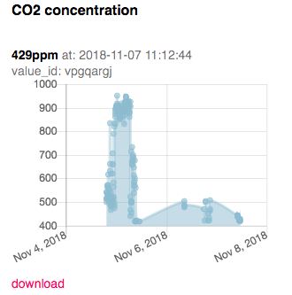

# mh-z19
Read CO2 concentration from mh-z19 sensor&amp; send to [MONITOR](https://monitor.uedasoft.com) server


## Install & Settup

### Full Install
Install full packages to read mh-z19 sensor, to handle the value to save, send and so on, and to make systemctl service with following steps:

download from [release](https://github.com/UedaTakeyuki/mh-z19/releases)

or 

```
git clone https://github.com/UedaTakeyuki/mh-z19.git
```

Then,

```
./setup.sh 
```

### Install only sensor module

```bash:
pip install pip install mh-z19
```

Please refer [PyPi top page](https://pypi.org/project/mh-z19/) for detail.

## cabling
Connect RPi & mh-z19 as:

- 5V on RPi and Vin on mh-z19
- GND(0v) on RPi and GND on mh-z19
- TxD and RxD are connect to cross between RPi and mh-z18 

Followings are example of cabling, but you can free to use other 5v and 0v Pin on the RPi. 


```
pi@raspberrypi:~/mh-z19 $ gpio readall
 +-----+-----+---------+------+---+---Pi B+--+---+------+---------+-----+-----+
 | BCM | wPi |   Name  | Mode | V | Physical | V | Mode | Name    | wPi | BCM |
 +-----+-----+---------+------+---+----++----+---+------+---------+-----+-----+
 |     |     |    3.3v |      |   |  1 || 2  |   |      | 5v      |     |     |
 |   2 |   8 |   SDA.1 |   IN | 1 |  3 || 4  |   |      | 5v      |     |     |  <---- Vin
 |   3 |   9 |   SCL.1 |   IN | 1 |  5 || 6  |   |      | 0v      |     |     |  <---- Gnd
 |   4 |   7 | GPIO. 7 |   IN | 1 |  7 || 8  | 1 | ALT0 | TxD     | 15  | 14  |  <---- RxD
 |     |     |      0v |      |   |  9 || 10 | 1 | ALT0 | RxD     | 16  | 15  |  <---- TxD
 |  17 |   0 | GPIO. 0 |   IN | 0 | 11 || 12 | 0 | IN   | GPIO. 1 | 1   | 18  |
 |  27 |   2 | GPIO. 2 |   IN | 0 | 13 || 14 |   |      | 0v      |     |     |
 |  22 |   3 | GPIO. 3 |   IN | 0 | 15 || 16 | 0 | IN   | GPIO. 4 | 4   | 23  |
 |     |     |    3.3v |      |   | 17 || 18 | 0 | IN   | GPIO. 5 | 5   | 24  |
 |  10 |  12 |    MOSI |   IN | 0 | 19 || 20 |   |      | 0v      |     |     |
 |   9 |  13 |    MISO |   IN | 0 | 21 || 22 | 0 | IN   | GPIO. 6 | 6   | 25  |
 |  11 |  14 |    SCLK |   IN | 0 | 23 || 24 | 1 | IN   | CE0     | 10  | 8   |
 |     |     |      0v |      |   | 25 || 26 | 1 | IN   | CE1     | 11  | 7   |
 |   0 |  30 |   SDA.0 |   IN | 1 | 27 || 28 | 1 | IN   | SCL.0   | 31  | 1   |
 |   5 |  21 | GPIO.21 |   IN | 1 | 29 || 30 |   |      | 0v      |     |     |
 |   6 |  22 | GPIO.22 |   IN | 1 | 31 || 32 | 0 | IN   | GPIO.26 | 26  | 12  |
 |  13 |  23 | GPIO.23 |   IN | 0 | 33 || 34 |   |      | 0v      |     |     |
 |  19 |  24 | GPIO.24 |   IN | 0 | 35 || 36 | 0 | IN   | GPIO.27 | 27  | 16  |
 |  26 |  25 | GPIO.25 |   IN | 0 | 37 || 38 | 0 | IN   | GPIO.28 | 28  | 20  |
 |     |     |      0v |      |   | 39 || 40 | 0 | IN   | GPIO.29 | 29  | 21  |
 +-----+-----+---------+------+---+----++----+---+------+---------+-----+-----+
 | BCM | wPi |   Name  | Mode | V | Physical | V | Mode | Name    | wPi | BCM |
 +-----+-----+---------+------+---+---Pi B+--+---+------+---------+-----+-----+
```

## read CO2 Sensor value
```
pi@raspberrypi:~ $ sudo python -m mh_z19 
{'co2': 668}
```

## How to use sensor value to send to server, save to strage, and so on.
This modlue correspond the [pondslider](https://pypi.org/project/pondslider/) which is multiple & varsataile sensor handler to save, send and to do other necessary ***something*** with the sensor value.

In case you choiced ***Full Install*** mentioned above, in other words, you've done ***setup.sh***,
the pondslider and there example handler's are already installed & setup.

### A briaf explanation of how to use pondslider
The pondslider read sensorvalue by ***sensor-handler*** specified, and pass the values to ***value-handlers**** which do something with it.


Both sensor and valule handlers are python module. For more detail of handlers, please refer [this](https://pypi.org/project/pondslider/).

### How to save CO2 value on a SD card as a .CSV file.
You can do it with ***save2strage*** value handler which is in ***handlers/value/saver/save2strage***, and configration file to read from mh-z19 sensor and save by save2strage is prepared as ***config.save.toml*** on the mh-z19 installed folder.

On the mh-z19 folder By calling pondslider as follows;

```
sudo python -m pondslider --config config.save.toml
```

Then, ***/home/pi/DATA/co2.csv*** shoud be created and new line will be added for each call.

### How to send CO2 Value to the MONITOR™ Service

The MONITOR™ is a free Remote Monitoring Servcie Developped and by ***me***. I'm berry grad if you use MONITOR™ to watching CO2 Value and give me your ***any*** feedback.



Sign up as [this](https://monitor.uedasoft.com/docs/UserGuide/Signup.html), Activate View element and get a view_id as [this](https://monitor.uedasoft.com/docs/UserGuide/Value.html).

Then, set your view_id to the configration file by issue ***setid.sh*** command in the mh_z19 installed directory. Let's say your view_id is ***vpgpargj***, then issue ***setid.sh*** command as follows:

```
sudo python -m pondslider
```

Your time-series chart on the MONITOR™ display shoud be updated by the latest CO2 concentration value.

### How to set your Raspberry Pi to send CO2 data to MONITOR™ at 5 minute interval.
You can set it by autostart.sh command in the mh_z19 installed directory as follows:

```
./autostart.sh --on
```

Turn off this as follows:

```
./autostart.sh --off
```

Check current status as follows:


```
./autostart.sh --status
```

### How to send CO2 Value to the ATT M2X.

The Pondslider also support ATT M2X. For detail, please refer [this](https://github.com/UedaTakeyuki/handlers/blob/master/value/sender/send2m2x/README.md) document.

### Q&A
Any questions, suggestions, reports are welcome! Please make [issue](https://github.com/UedaTakeyuki/mh-z19/issues) without hesitation! 

## history
- 0.1.0  2018.09.13  first version self-forked from [slider](https://github.com/UedaTakeyuki/slider).
- 0.2.2  2018.11.19  introduce [pondslider](https://pypi.org/project/pondslider/) and separate this [PyPi](https://pypi.org/project/mh-z19/) package.
